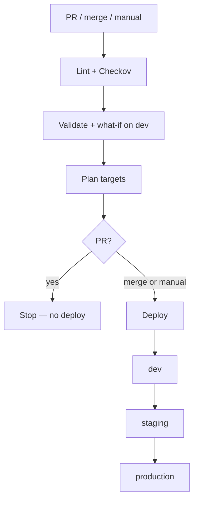

# Infra-Cloud

## Repository layout

```text
infra-cloud/
├── README.md
└── projects/
    ├── board-advisors/          # one workload
    └── project-xyz/             # another workload — same shape, different names
```

Each project is self-contained:

```text
projects/<name>/
├── main.bicep                   # orchestrator — the only file you deploy
├── main.json                    # compiled ARM (generated, do not edit)
├── modules/
│   └── resource-group.bicep     # one job: create a resource group
├── params/
│   ├── dev.bicepparam
│   ├── staging.bicepparam
│   └── prod.bicepparam
└── .github/workflows/
    └── multistage-cicd-pipeline.yml
```

**One folder = one workload.** board-advisors and project-xyz do not share resource groups. Add `projects/another-app/` without touching the others.

> GitHub Actions runs workflows from the **repo-root** `.github/workflows/`

---

## What we deploy:

Each project creates **one resource group per environment**, all in `westus`.

| Project | Pattern | Dev | Staging | Production |
|---------|---------|-----|---------|------------|
| **board-advisors** | `rg-bicep-github-actions-${env}` | `rg-bicep-github-actions-dev` | `rg-bicep-github-actions-staging` | `rg-bicep-github-actions-production` |
| **project-xyz** | `rg-project-${env}` | `rg-project-dev` | `rg-project-staging` | `rg-project-production` |

The pattern does not change when you add storage, networking, or apps. Those become more modules under the same group.

---

## How the pieces fit

### `main.bicep` — orchestrator

The file Azure CLI and the pipeline point at. It does not create the group itself. It **calls the module**.

| Parameter | Role |
|-----------|------|
| `environment` | `dev` \| `staging` \| `production` |
| `location` | Region of the resource group |
| `resourceGroupName` | Azure name of the group |
| `resourceGroupTags` | Tags (`environment`, `source`) |

```bicep
module rg 'modules/resource-group.bicep' = {
  name: 'rg-${environment}'          // nested deployment label — not the group name
  params: {
    name: resourceGroupName
    location: location
    tags: resourceGroupTags
  }
}
```

`targetScope = 'subscription'` is required. A resource group lives on the subscription, not inside another group. Deploy with `az deployment sub`, not `az deployment group`.

### `modules/resource-group.bicep` — worker

Reusable. Environment-agnostic. Three inputs, three outputs.

| Inputs | Outputs |
|--------|---------|
| `name`, `location`, `tags` | `name`, `id`, `location` |

Why a module, not an inline resource?

- One file, one responsibility.
- The same module can be referenced from any project’s `main.bicep`.
- The next resource is another module. `main.bicep` stays a short list of calls.

### `params/*.bicepparam` — environment data

The template stays still. These files move.

```bicep
using '../main.bicep'

param environment = 'dev'
param location = 'westus'
param resourceGroupName = 'rg-project-dev'
param resourceGroupTags = {
  environment: 'dev'
  source: 'bicep-github-actions'
}
```

| File | Environment value | Used for |
|------|-------------------|----------|
| `params/dev.bicepparam` | `dev` | Local work, PR preview, first deploy |
| `params/staging.bicepparam` | `staging` | Staging after dev |
| `params/prod.bicepparam` | `production` | Production (`prod` is the file name only) |

Modules do **not** have their own param files. `main.bicep` forwards values down.

**One locations, different jobs**

| Value | Meaning |
|-------|---------|
| `location` in the param file | Where the **resource group** is created (`westus`) |
| `--location` on `az deployment sub` | Where Azure stores the **deployment record** (`westus` in CI) |

Change a group name or region in the param file. Do not edit the module for that.

### `main.json`

Output of `az bicep build`. ARM that Azure Resource Manager consumes. Source of truth is always `.bicep`.

---

## Glossary

| Term | Meaning |
|------|---------|
| **Bicep** | Microsoft’s language for Azure resources. Compiles to ARM JSON. |
| **ARM (`main.json`)** | Compiled template. Do not edit by hand. |
| **Subscription scope** | Required to create a resource group. `targetScope = 'subscription'`. |
| **Module** | A `.bicep` file called by `main.bicep`. One job per file. |
| **`.bicepparam`** | Values for one environment. Template stays the same. |
| **What-if** | Dry run. Shows create / change / delete. Applies nothing. |
| **OIDC** | GitHub logs into Azure with a federated identity. No password in the repo. |

---

## Deploy locally

Requires Azure CLI (Bicep extension) and rights to create resource groups.

```bash
az login
az account set --subscription <subscription-id>
cd projects/board-advisors
```

```bash
# Compile — no Azure changes
az bicep build --file main.bicep

# Preview
az deployment sub what-if \
  --name whatif-dev \
  --location westus \
  --template-file main.bicep \
  --parameters params/dev.bicepparam

# Apply
az deployment sub create \
  --name deploy-dev \
  --location westus \
  --template-file main.bicep \
  --parameters params/dev.bicepparam
```

Swap the param file for staging or production and change the parameters accordingly based on the environment.

---

## Pipeline

Defined in `projects/<name>/.github/workflows/multistage-cicd-pipeline.yml`.



| Trigger | Result |
|---------|--------|
| Pull request to `main` | Lint, scan, what-if on **dev**. No deploy. |
| Merge to `main` | Same preview, then **dev → staging → production**, one at a time. |
| Manual run | One environment only. |

OIDC credentials are bound to `main` (and PRs into it). No branch wildcards.

| Job | Purpose |
|-----|---------|
| **Lint and scan** | `az bicep build`, then Checkov. SARIF uploaded to the PR. Self-hosted runner: `self-hosted, linux, ubuntu, azure`. |
| **Preview (dev)** | OIDC login → `validate` → `what-if`. Report goes to the job summary and the PR comment. |
| **Plan targets** | Merge = all three environments. Manual = the one you picked. `production` uses `params/prod.bicepparam`. |
| **Deploy** | `fail-fast`, `max-parallel: 1`. Staging fails → production does not start. What-if, then `create`. |

GitHub Environments must be named exactly `dev`, `staging`, `production`. Turn on **required reviewers** in Settings → Environments. Approvals are not in the YAML.

| Secret | Purpose |
|--------|---------|
| `AZURE_CLIENT_ID` | App registration client ID |
| `AZURE_TENANT_ID` | Microsoft Entra tenant |
| `AZURE_SUBSCRIPTION_ID` | Target subscription |

Workflow permission: `id-token: write` (OIDC token).

---

## Extend it

### Add a resource inside the group

```bicep
module storage 'modules/storage.bicep' = {
  name: 'storage-${environment}'
  scope: resourceGroup(rg.outputs.name)
  params: {
    location: rg.outputs.location
  }
}
```

`scope` places the child in the group **and** waits until the group exists.

### Add a project

1. Copy `projects/project-xyz/` to `projects/<new-name>/`.
2. Give each `params/*.bicepparam` unique `resourceGroupName` values.
3. Update the default name in `main.bicep` if you want a new pattern.
4. Point CI at that folder’s `main.bicep`.

Do not reuse another project’s group names.

---

## Troubleshooting

| Symptom | Cause |
|---------|--------|
| `az deployment group` fails | Resource groups need `az deployment sub`. |
| Wrong group name in Azure | Edit the env `.bicepparam`, not the module. |
| Group in the “wrong” region | Param `location` is the group. CLI `--location` is only the deployment record. |
| Actions never runs | Workflow is under `projects/.../.github/`, not the repo root. |
| Login fails in Actions | Missing OIDC secrets, or Environment name is not `dev` / `staging` / `production`. |
| Production skipped | Staging failed, this was a PR, or an approver has not signed off. |

---

## Mental model

| Piece | One line |
|-------|----------|
| **This repo** | Source of truth for Azure infrastructure |
| **`projects/<name>/`** | One workload |
| **`main.bicep`** | What to deploy, and in what order |
| **`modules/*.bicep`** | How to create one resource type |
| **`params/*.bicepparam`** | Values for one environment |
| **Pipeline** | Lint → preview on PRs → staged deploy on merge |
| **Azure** | Matches the files. Nothing else. |
