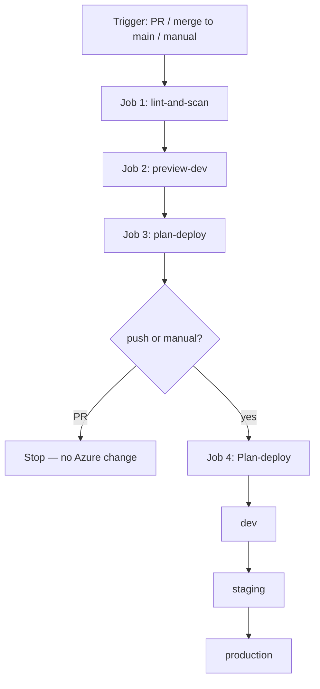

# Infra-Cloud

## Repository layout

```text
infra-cloud/
├── README.md
└── projects/
    ├── board-advisors/          # one workload
    └── project-xyz/             # another workload — same shape, different names
```

Each project is self-contained:

```text
projects/<name>/
├── main.bicep                   # orchestrator — the only file you deploy
├── main.json                    # compiled ARM (generated, do not edit)
├── modules/
│   └── resource-group.bicep     # one job: create a resource group
├── params/
│   ├── dev.bicepparam
│   ├── staging.bicepparam
│   └── prod.bicepparam
└── .github/workflows/
    └── multistage-cicd-pipeline.yml
```

**One folder = one workload.** board-advisors and project-xyz do not share resource groups. Add `projects/another-app/` without touching the others.

> GitHub Actions runs workflows from the **repo-root** `.github/workflows/`

---

## What we deploy:

Each project creates **one resource group per environment**, all in `westus`.

| Project | Pattern | Dev | Staging | Production |
|---------|---------|-----|---------|------------|
| **board-advisors** | `rg-bicep-github-actions-${env}` | `rg-bicep-github-actions-dev` | `rg-bicep-github-actions-staging` | `rg-bicep-github-actions-production` |
| **project-xyz** | `rg-project-${env}` | `rg-project-dev` | `rg-project-staging` | `rg-project-production` |

The pattern does not change when you add storage, networking, or apps. Those become more modules under the same group.

---

## How the pieces fit

### `main.bicep` — orchestrator

The file Azure CLI and the pipeline point at. It does not create the group itself. It **calls the module**.

| Parameter | Role |
|-----------|------|
| `environment` | `dev` \| `staging` \| `production` |
| `location` | Region of the resource group |
| `resourceGroupName` | Azure name of the group |
| `resourceGroupTags` | Tags (`environment`, `source`) |

```bicep
module rg 'modules/resource-group.bicep' = {
  name: 'rg-${environment}'          // nested deployment label — not the group name
  params: {
    name: resourceGroupName
    location: location
    tags: resourceGroupTags
  }
}
```

`targetScope = 'subscription'` is required. A resource group lives on the subscription, not inside another group. Deploy with `az deployment sub`, not `az deployment group`.

### `modules/resource-group.bicep` — worker

Reusable. Environment-agnostic. Three inputs, three outputs.

| Inputs | Outputs |
|--------|---------|
| `name`, `location`, `tags` | `name`, `id`, `location` |

Why a module, not an inline resource?

- One file, one responsibility.
- The same module can be referenced from any project’s `main.bicep`.
- The next resource is another module. `main.bicep` stays a short list of calls.

### `params/*.bicepparam` — environment data

The template stays still. These files move.

```bicep
using '../main.bicep'

param environment = 'dev'
param location = 'westus'
param resourceGroupName = 'rg-project-dev'
param resourceGroupTags = {
  environment: 'dev'
  source: 'bicep-github-actions'
}
```

| File | Environment value | Used for |
|------|-------------------|----------|
| `params/dev.bicepparam` | `dev` | Local work, PR preview, first deploy |
| `params/staging.bicepparam` | `staging` | Staging after dev |
| `params/prod.bicepparam` | `production` | Production (`prod` is the file name only) |

Modules do **not** have their own param files. `main.bicep` forwards values down.

**One locations, different jobs**

| Value | Meaning |
|-------|---------|
| `location` in the param file | Where the **resource group** is created (`westus`) |
| `--location` on `az deployment sub` | Where Azure stores the **deployment record** (`westus` in CI) |

Change a group name or region in the param file. Do not edit the module for that.

### `main.json`

Output of `az bicep build`. ARM that Azure Resource Manager consumes. Source of truth is always `.bicep`.

---

## Glossary

| Term | Meaning |
|------|---------|
| **Bicep** | Microsoft’s language for Azure resources. Compiles to ARM JSON. |
| **ARM (`main.json`)** | Compiled template. Do not edit by hand. |
| **Subscription scope** | Required to create a resource group. `targetScope = 'subscription'`. |
| **Module** | A `.bicep` file called by `main.bicep`. One job per file. |
| **`.bicepparam`** | Values for one environment. Template stays the same. |
| **What-if** | Dry run. Shows create / change / delete. Applies nothing. |
| **OIDC** | A short-lived “visitor pass.” GitHub proves *this pipeline run* is allowed to talk to Azure. No Azure password is saved in GitHub. |

---

## Deploy locally

Requires Azure CLI (Bicep extension) and rights to create resource groups.

```bash
az login
az account set --subscription <subscription-id>
cd projects/board-advisors
```

```bash
# Compile — no Azure changes
az bicep build --file main.bicep

# Preview
az deployment sub what-if \
  --name whatif-dev \
  --location westus \
  --template-file main.bicep \
  --parameters params/dev.bicepparam

# Apply
az deployment sub create \
  --name deploy-dev \
  --location westus \
  --template-file main.bicep \
  --parameters params/dev.bicepparam
```

Swap the param file for staging or production and change the parameters accordingly based on the environment.

---

## Pipeline

File: `projects/<name>/.github/workflows/multistage-cicd-pipeline.yml`.

This workflow takes Bicep from the repo to Azure. It does three things, in order: **check the template**, **show what would change**, then **deploy** — and only after a merge or a manual run.

There are no formal YAML “stages.” GitHub Actions uses **jobs**. This file treats jobs as stages: lint → preview → plan → deploy.



The same workflow exists under `board-advisors` and `project-xyz`. Behavior is identical; only the project folder (and that project’s param files) differs.

### Header — when it runs, and with what rights

| Block | Purpose |
|-------|---------|
| `name: Bicep CI/CD` | Label in the Actions tab. |
| `on.push` / `on.pull_request` to `main` | Run on PRs into `main` and on merges to `main`. OIDC federated credentials cannot use branch wildcards, so other branches are excluded on purpose. |
| `on.workflow_dispatch` | You click **Run workflow** yourself in GitHub. GitHub asks: deploy to **dev**, **staging**, or **production**? It then deploys **only that one**. |
| `env.LOCATION: westus` | Region for the **subscription deployment record**, not the resource group. The group region comes from the `.bicepparam`. |
| `permissions` | Least privilege for this workflow. |

**Permissions**

| Permission | Why it is needed |
|------------|------------------|
| `id-token: write` | Lets GitHub create a short-lived visitor pass (OIDC token) so the pipeline can log into Azure. No Azure password is stored in the repo. |
| `contents: read` | Checkout the repo. |
| `security-events: write` | Upload Checkov findings as SARIF. |
| `pull-requests: write` | Post the what-if comment on the PR. |

**OIDC in plain words:** Azure will not accept a saved password from this workflow. Instead, each run GitHub writes a temporary pass that says “this job is from *this* GitHub repo, *this* environment.” Azure already trusts that GitHub app. It checks the pass, lets the job in, then the pass expires. That is safer than keeping an Azure password in GitHub Secrets.

The workflow still stores three IDs (who to log in as, not a password): `AZURE_CLIENT_ID`, `AZURE_TENANT_ID`, `AZURE_SUBSCRIPTION_ID`.

OIDC is allowed only for `main` and PRs into `main`. Other branches cannot use this login.

GitHub Environments must be named exactly `dev`, `staging`, `production`. Turn on **required reviewers** in Settings → Environments. Approvals are not in the YAML.

### Job 1 — `lint-and-scan`

**Stage: quality gate. No Azure login. Nothing is created.**

Runs first. If this fails, preview and deploy do not start.

`runs-on: [self-hosted, linux, ubuntu, azure]` — uses the self-hosted runner, not GitHub-hosted.

| Step | Purpose |
|------|---------|
| **Checkout** | Clone the commit that triggered the run so later steps see the Bicep files. |
| **Bicep Lint** | `az bicep build --file main.bicep`. If the template does not compile, the pipeline stops. Cheaper than failing in Azure. |
| **Run Checkov** | Static security scan of Bicep (misconfigurations, weak defaults). Writes `results.sarif`. |
| **Upload SARIF** | Sends that report to GitHub Code Scanning. `if: success() \|\| failure()` means the upload still runs if Checkov finds issues, so findings stay visible on the PR. |

### Job 2 — `preview-dev`

**Stage: dry run against dev. Azure is contacted. Nothing is applied.**

`needs: [lint-and-scan]` — waits for lint.  
`environment: dev` — uses the GitHub Environment named `dev` (secrets + optional reviewers). OIDC subject is `repo:ORG/REPO:environment:dev`.  
`runs-on: ubuntu-latest` — GitHub-hosted runner.

This job runs on **every** trigger (PR, merge, manual) so reviewers always see a plan.

| Step | Purpose |
|------|---------|
| **Checkout** | Fresh clone on this runner. |
| **Az CLI login** | OIDC login with the three Azure secrets. No client secret in the repo. |
| **Bicep Validate** | `az deployment sub validate` with `params/dev.bicepparam`. Azure checks template + params (schema, names, types). Still no create/update. |
| **What-If** | `az deployment sub what-if` — the real preview: create / change / delete. Output is saved to a file named `whatif`. |
| **Create String Output** | Wraps that text as Markdown (collapsible `<details>`) and stores it as a step output. The random delimiter avoids breaking GitHub’s output format if the what-if text is large. |
| **Publish Whatif to Task Summary** | Puts the same report on the Actions **job summary** so you can read it without opening logs. |
| **Push Whatif Output to PR** | Only when `github.event_name == 'pull_request'`. Posts the report as a PR comment so reviewers see impact without leaving the PR. |

### Job 3 — `plan-deploy`

**Stage: decide which environments the deploy job will run.**

`needs: [lint-and-scan, preview-dev]`.  
No Azure. One step. It writes a **matrix** JSON that Job 4 reads.

It always runs, including on PRs, so the job graph stays complete. Job 4 itself skips on PRs.

| How you started it | What gets a deploy slot |
|--------------------|-------------------------|
| You clicked **Run workflow** and picked one env | Only that one. If you picked production, it uses `params/prod.bicepparam` (the file is named `prod`, the env is named `production`). |
| You opened a PR or merged to `main` | All three: `dev`, `staging`, `production`. |

Output: `matrix` on the job, consumed as `needs.plan-deploy.outputs.matrix`.

### Job 4 — `deploy`

**Stage: apply infrastructure. This is the only job that changes Azure.**

```yaml
if: github.event_name == 'push' || github.event_name == 'workflow_dispatch'
```

Think of three doors into the same pipeline:

| How it started | Does Azure get updated? | In plain words |
|----------------|-------------------------|----------------|
| Someone opened a **pull request** | No | “Show me the plan. Do not build anything yet.” |
| Someone **merged to `main`** | Yes — **dev, then staging, then production** | “The change is approved. Roll it out everywhere, in order.” |
| Someone clicked **Run workflow** (manual) | Yes — **only the env they chose in the dropdown** | “I only want to update staging today” (or only dev, or only production). |

**Manual run example:** GitHub Actions → **Bicep CI/CD** → **Run workflow**. You select `staging` and click Run. The pipeline still checks the code and shows a what-if for dev. Then it **creates/updates Azure only for staging**. Dev and production are left alone in that run.

`needs: [plan-deploy]`.  
`environment: ${{ matrix.environment }}` — `dev`, then `staging`, then `production`. Each can have its own secrets and required reviewers (set in GitHub UI, not in this YAML).

**Strategy**

| Setting | Meaning |
|---------|---------|
| `max-parallel: 1` | One environment at a time. |
| `fail-fast: true` | If staging fails, production does not start. |
| `matrix` | One job instance per planned environment. |

### Add a project

1. Copy `projects/project-xyz/` to `projects/<new-name>/`.
2. Give each `params/*.bicepparam` unique `resourceGroupName` values.
3. Update the default name in `main.bicep` if you want a new pattern.
4. Point CI at that folder’s `main.bicep`.

Do not reuse another project’s group names.
